

<a href="https://github.com/vitormicillo"></a><a href="https://bit.ly/doode-website"></a><a href="https://www.linkedin.com/in/vitormicillo"></a><a href="https://bit.ly/doode-youtube"></a><a href="https://bit.ly/doode-social"></a>
<a href="https://github.com/vitormicillo/laravel-formbuilder"></a><a href="https://github.com/vitormicillo/filament-map-picker"></a>
<a href="https://github.com/vitormicillo/doode"></a><a href="https://github.com/vitormicillo/leaflet-map-print"></a>
<!-- writing:start -->

<!-- writing:end -->

